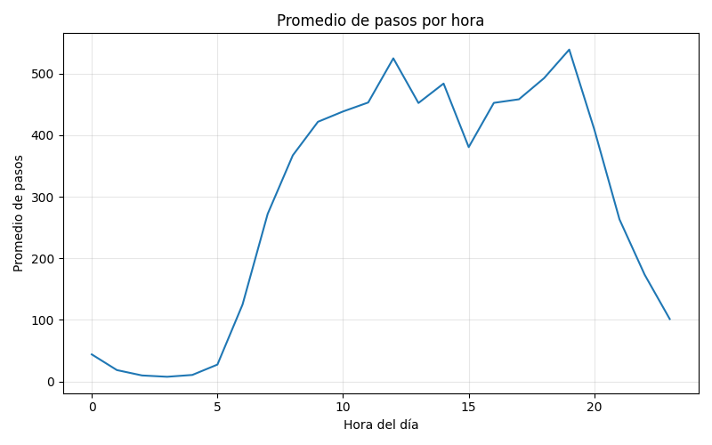

# Proyecto de Ciencia de Datos

## Limpieza y Transformación de Datos de Actividad Física

---

## Integrantes

- Vicente Castro  
- Lucas Fernandez  
- Julian Martinez  

---

## Descripción del Proyecto

El presente proyecto tiene como objetivo transformar un dataset de actividad física en un conjunto de datos limpio, estructurado y listo para su análisis.

Se aplicaron técnicas fundamentales de ciencia de datos, incluyendo limpieza de datos, transformación mediante pipelines, generación de nuevas variables (feature engineering) y análisis visual.

---

## Dataset

Se trabajó con los archivos:
- `hourlySteps_sucio.csv`
- `hourlySteps_clean.csv`

Tipo de datos: actividad física (cantidad de pasos por hora)  
Formato: CSV  

Columnas del dataset:
- Id  
- ActivityHour  
- StepTotal  
- Hora  
- Dia  
- FinDeSemana  
- StepTotal_scaled  

---

## Objetivos

- Limpiar el dataset eliminando errores e inconsistencias  
- Transformar los datos utilizando herramientas automatizadas  
- Generar nuevas variables relevantes  
- Obtener un dataset final listo para análisis o modelamiento  

---

## Metodología

### Diagnóstico inicial
Se identificaron nulos, duplicados y tipos de datos.

### Limpieza de datos
Se eliminaron duplicados (`drop_duplicates`) y valores nulos (`dropna`).

### Feature engineering
Se generaron variables:
- Hora  
- Dia  
- FinDeSemana  

### Transformación
Se aplicó escalado sobre `StepTotal`.

---

## Análisis y Visualización

### Promedio de pasos por hora

El siguiente gráfico muestra el comportamiento promedio de la actividad física durante el día:

---

### Detección de outliers

Se utilizó un boxplot para identificar valores atípicos en `StepTotal`.

Los outliers no fueron eliminados, ya que pueden representar actividad física real.

---

## Tecnologías Utilizadas

- Python  
- Pandas  
- NumPy  
- Matplotlib  
- Scikit-learn  
- Google Colab  

---

## Conclusión

Se logró construir un dataset limpio y estructurado, permitiendo analizar patrones de actividad física por hora y tipo de día.

El proyecto demuestra un flujo completo de preparación de datos, desde la limpieza hasta la visualización.

